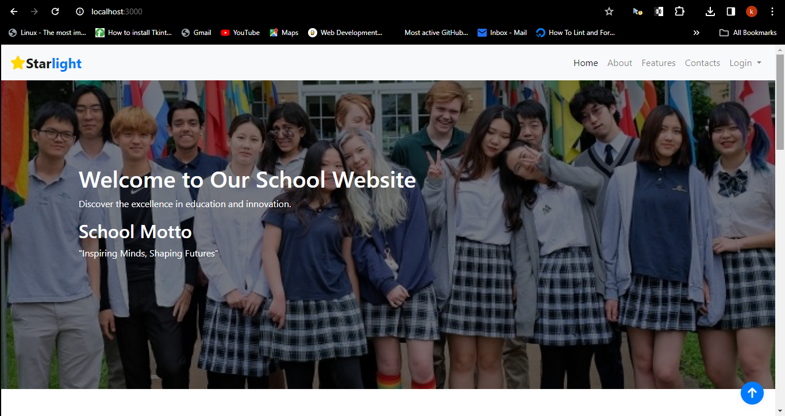
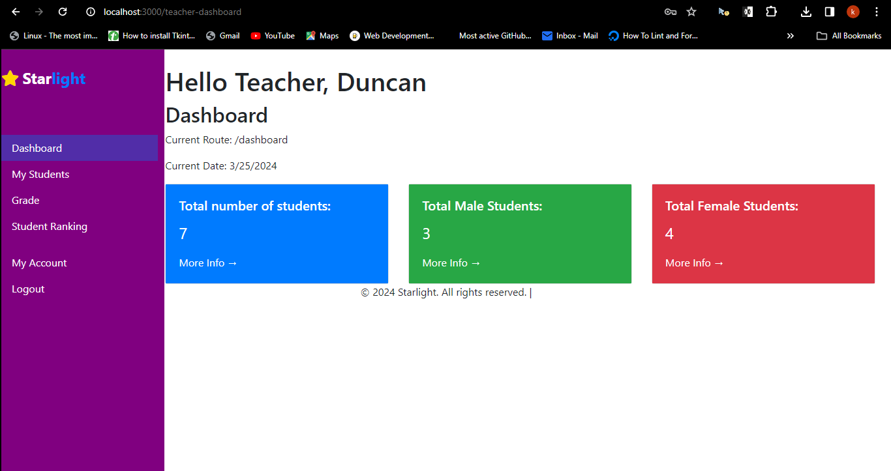

<h2>Starlight School System</h2>

<h3>Description</h3>

Welcome to Starlight School System
 

## Table of Contents

1. [Installation](#installation)
2. [Usage](#usage)
3. [Features](#features)
4. [Contributing](#contributing)
5. [License](#license)
6. [Special Thanks](#special-thanks)

## Installation

1. Clone the repository
2. Navigate to the project directory
3. To install the required dependencies, you can use npm. Run the following command:
   `npm install`

## Usage

We didn't want to push our `.env` file to the repo because of security measures,
so before you continue with anything do the following:

1. Create a `.env` should be on the same path with `app.js`
2. Inside the `.env` file you should have the following content:
   `SESSION_SECRET="Put your secret key here"`
   `ADMIN_USERNAME=admin`
   `ADMIN_PASSWORD=admin`
   `MONGODB_URI="Enter your mongodb URI here"`

3. Now after successfully creating the `.env` file
4. Run `node app` to start the application
5. Open your browser and go to `http://localhost:3000`

## Features

1. When you go to `http://localhost:3000` you will first see a landing page:
   
2. Login page for both Admin and Teachers:
   
3. Admin Dashboard:
   
4. Teacher Dashboard:
   Teachers will only access the `Teacher Dashboard` when admin as already added them into the school system
   

## Contributing

We welcome contributions! Please follow these guidelines:

1. Fork the repository
2. Create a new branch
3. Make your changes
4. Submit a pull request

## Contributors

1. Brian Jalang'o - brianhannington94@gmail.com
2. Duncan Musau - kokidanny15@gmail.com
3. Syphrose Wabulwenyi - swabulwenyi@gmail.com

## License

This project is licensed under the [MIT License](LICENSE)

## Special Thanks

We would like to express our heartfelt gratitude to [ALX](https://www.alxafrica.com/) for providing us with the invaluable opportunity to participate in the Software Engineering Programme. This intensive and enriching 12-month journey has equipped us with the skills, knowledge, and mindset needed to tackle real-world software challenges.

We are also deeply thankful to our peers and colleagues who generously shared their time, expertise, and support throughout this project and the entire duration of the programme. Your collaboration, encouragement, and guidance have been instrumental in our growth and success.

This project marks the end of our journey with ALX, and we are proud to present our collective efforts as a testament to the transformative power of education and collaboration.

Thank you, ALX, and thank you to all our peers, for being part of this remarkable journey with us.
